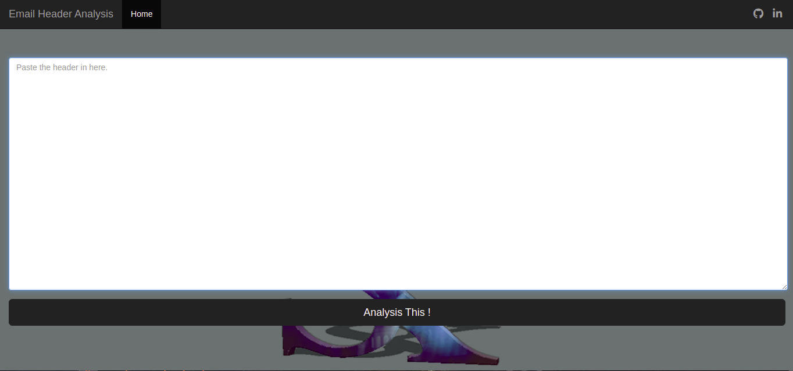

# Email_Header_analysis
  
  
<h1 align="center">
  <br>
  <!-- <a href="https://github.com/Shubhamkhapra/Email_header_analysis_forensic"></a>
  <br> -->
  Email Header Analysis
  <br>
</h1>
	
<p align="center">
  <a href="https://github.com/Shubhamkhapra/Email_header_analysis_forensic">
    
    

  </a>
</p>

## Introduction
**Email Header (EHA) Forensic Investigation** Nobody likes or wants SPAM. And yet our inboxes are full of it.It is not only plain intrusive, it also puts our online identity at risk. Phishing attacks have only been on the rise ever since they came into existence.It’s not easy to detect phishing emails
While some of the emails we receive are obvious spam, most of them are not very easy to recognise just by seeing the content or the sender.
But there’s a way..
Here comes the advance debugging of email which is commonly known as analysing the email headers.
How to analyse the Received parameter in the mail headers
Each mail server which handles an email message adds a Received: header set to the front of the message; the first set is therefore added by your mail server.
The first Received header shows that the email was actually originated from a server with IP address 10.200.41.121

## Main Features
```python
- Identify Hop Dealys.
- Identify the source of the email.
- Check SPF record
- Check DKIM-singature
- Check MIME-version
- Check Message ID
```
## ⚡ Installation
```
Install system Dependencies:
~> sudo apt-get update
~> sudo apt-get install python3-pip
~> sudo pip3 install virtualenv

Clone the GitHub repo & install python Dependencies :
~> git clone https://github.com/Shubhamkhapra/Email_header_analysis_forensic.git
~> cd Email_header_analysis_forensic

Create a Python virtual environment and activate it: (Because Flask need to run virtual environment)
~>virtualenv virt
~>python3 -m venv virt
~>source virt/bin/activate
~>python3 -m pip install -r requirements.txt

Run the server:
~>cd eha
~>python3 server.py

Everything should go well now vist  Running on http://127.0.0.1:8080/
enjoy EHA
```
```
1. Show localhost address
```


```
2. Copy and Paste header in box
```


```
3. Result 
```


## Key Points EHA?
````
1. Copy Header and paste into EHA Box.
2. Each mail server which handles an email message adds a Received: 
header set to the front of the message; the first set is therefore added by your mail server.
3. After  Check hop list.
4. Check the SPF record.
5. Received-SPF and DKIM-Signature
In the above example there are two more important parameters, Received-SPF and DKIM-Signature. 
Not every sender adds these, but most of the good/ big senders have now made it a practice to add SPF and DKIM. 
These parameters help in identifying the authenticity of the email.The header parameter in Received-SPF is showing as pass.
This means the domain seasonsms.com has allowed the IP address 103.52.181.228 to send emails on their behalf.
The next header parameter Authentication-Results: is showing dkim=pass. This means the long public key mentioned in the
parameter DKIM-Signature: matches with its associated private key stored on the actual sending server 103.52.181.228/pepipost.net server.
````
## GPCSSI2021 
```
Thanks to give me a chance of this internship. #GPCSSI2021

```
##  Contribution
You can contribute in following ways:
- Report bugs
- Develop tool
- Give suggestions to make it better
- Fix issues & submit a pull request
